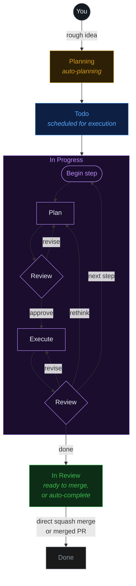

<div align="center">

#  agi

### От сырой идеи до production-кода — автоматически.

### 🏭 Софтверная фабрика под управлением мультиагентного оркестратора.

Опишите, что вам нужно — команда ИИ-агентов **спланирует, построит, проверит и доставит** это за вас. agi — это ваша софтверная фабрика: конвейер для кода, который работает поверх задач, агентов, миссий, git, файлов и рабочих деревьев, с любой моделью, локальной или облачной.

> **Переименованный, локализованный на русский форк [Fusion](https://github.com/Runfusion/Fusion) (MIT).** Атрибуцию и список изменений см. в [NOTICE](./NOTICE).

[**runfusion.ai →**](https://runfusion.ai) · [Документация](./docs/README.md) · [GitHub](https://github.com/agisota/agi) · [npm](https://www.npmjs.com/package/@runfusion/fusion) · [Discord](https://discord.gg/ksrfuy7WYR)

[English](./README.md) · [简体中文](./README.zh-CN.md) · [繁體中文](./README.zh-TW.md) · [Français](./README.fr.md) · [Español](./README.es.md) · [한국어](./README.ko.md) · **Русский**

[](./LICENSE)
[](https://www.npmjs.com/package/@runfusion/fusion)
[](https://discord.gg/ksrfuy7WYR)


<br />


<br />
<br />

<a href="https://runfusion.ai">
  
</a>

</div>

---

## Всё ваше окружение разработки. На одном экране.

Опишите задачу обычными словами. Агент планирования читает ваш проект, понимает контекст и пишет полный план `PROMPT.md` — шаги, область файлов, критерии приёмки. Затем agi планирует, ревьюит, исполняет и ревьюит снова — в изолированном рабочем дереве git, с гейтом ручного подтверждения там, где он вам нужен.

Одна доска. Управление откуда угодно. Ноутбук, Mac mini, Linux-сервер, облачная VM, телефон — всё связано.

> Как Trello, но ваши задачи специфицируются, исполняются и доставляются ИИ. Построено на отличной работе [dustinbyrne/kb](https://github.com/dustinbyrne/kb).

---

## Быстрый старт

**Без установки, прямо из npm:**

```bash
npx runfusion.ai
```

Это запускает панель. Подкоманды пробрасываются дальше: `npx runfusion.ai task create "fix X"`, `npx runfusion.ai --help` и т.д. (Или подробно: `npx @runfusion/fusion dashboard`.)

**Установщик одной строкой** (macOS и Linux — автоматически выбирает Homebrew, откатывается на npm):

```bash
curl -fsSL https://runfusion.ai/install.sh | sh
agi dashboard
```

**Homebrew** (macOS и Linux):

```bash
brew tap runfusion/fusion
brew install fusion
agi dashboard
```

Или одной строкой (с авто-tap): `brew install runfusion/fusion/fusion`.

**npm глобально**:

```bash
npm install -g @runfusion/fusion
agi dashboard
```

**Из клона** (для разработки):

```bash
pnpm dev dashboard
```

Затем кликните по URL `Open:`, напечатанному в терминале. Он содержит bearer-токен
(`http://localhost:4040/?token=fn_...`), который браузер сохраняет в
`localStorage` при первом визите и далее переиспользует автоматически. На стороне
сервера agi теперь сохраняет токен панели/демона в
`~/.fusion/settings.json` при первом аутентифицированном запуске и переиспользует его при последующих
стартах, пока вы его не переопределите (`--token`, `FUSION_DASHBOARD_TOKEN`,
`FUSION_DAEMON_TOKEN`) или не отключите аутентификацию через `--no-auth`. Полный порядок приоритетов и опции сброса/отзыва см. в
[справочнике CLI → agi dashboard → Authentication](./docs/cli-reference.md#fn-dashboard).

### Настройка при первом запуске

При первом запуске agi открывает **мастер онбординга** с тремя пошаговыми шагами:

1. **Настройка ИИ** — Используйте упрощённый список провайдеров для быстрого старта (рекомендуемые провайдеры плюс любые уже подключённые), затем раскройте **Advanced provider settings** только если вам нужны дополнительные провайдеры или детали настройки. Для начала работы достаточно одного провайдера. Устаревшие записи провайдеров Google Gemini CLI / Antigravity намеренно скрыты; пути Google/Gemini API key, Google Generative AI, Vertex и Cloud Code по-прежнему поддерживаются.
2. **GitHub (опционально)** — Подключите GitHub для импорта issue и управления PR
3. **Первая задача** — Создайте первую задачу или импортируйте из GitHub (если ни один проект не активен, онбординг сначала предложит зарегистрировать/выбрать каталог проекта)

Мастер **закрываемый и неблокирующий** — нажмите **Skip for now**, чтобы сразу пользоваться панелью. Повторно запустить его позже можно из **Settings → Authentication → Reopen onboarding guide**.

### Мобильные устройства

Про workflow Capacitor + PWA см. [MOBILE.md](./MOBILE.md).

---

## Поток работы

```
  ①  Опишите           ②  Планирование         ③  Доска               ④  Изолированное рабочее дерево
  ─────────────        ─────────────         ─────────────          ─────────────────────
  "Add dark mode   →   Agent writes    →   Plan → Review →    →   fusion/FN-123 branch
   toggle to           PROMPT.md           Execute → Review        concurrent, zero
   settings panel"     (steps, scope,      (per step, until        file conflicts
                       acceptance)         done)
```

### Видеть каждый шаг — до слияния

<div align="center">
  
</div>

Каждая задача показывает свой план, свои ревью, свои диффы и свои изменения файлов в реальном времени. Зайдите в активную задачу и подтолкните направление, ужесточите ограничения, поставьте на паузу или перепромптите.

---

## Чем это отличается

|  |  |
|---|---|
| 🧠 **ИИ-планирование** | Опишите задачу обычными словами. Агенты планирования превращают её в план `PROMPT.md` с шагами, областью файлов и критериями приёмки. |
| 🔁 **Выбираемые рабочие процессы** | Встроенные покрывают кодинг, быстрые фиксы, работу с упором на ревью, пошаговое исполнение, Compound Engineering (с гейтом плагина) и фрагменты жизненного цикла PR. Выберите рабочий процесс на задачу или напишите свой в [Редакторе рабочих процессов](./docs/workflow-editor.md). |
| 🌳 **Изоляция рабочих деревьев** | Каждая задача выполняется в собственной ветке и рабочем дереве (`fusion/{task-id}`). Параллельные задачи. Ноль конфликтов. Опциональное делегирование в [worktrunk](https://github.com/max-sixty/worktrunk) через [`worktrunk.enabled`](./docs/settings-reference.md#worktree-backend-settings) (см. [абстракцию WorktreeBackend](./docs/architecture.md#worktreebackend-abstraction)). |
| ⚡ **Умное управление слиянием** | Прошли все гейты? agi делает squash-слияние и идёт дальше. Включите ручное подтверждение где угодно, наследуйте живой глобальный дефолт авто-слияния или задайте явные авто/ручные переопределения на задачу. |
| 🛰️ **Мульти-узловая mesh-сеть** | Ноутбук, Mac mini, Linux-сервер, облачная VM, телефон — всё синхронизировано. Десктоп, мобильные, web. |
| 🧩 **Любая модель** | Anthropic, OpenAI, Ollama, Google Generative AI, Z.ai, локальные рантаймы и пользовательские [кастомные провайдеры](./docs/dashboard-guide.md#custom-providers). Локальное и облачное сосуществуют, с настраиваемыми на проект линиями модели/фолбэка рабочего процесса. |
| 🏢 **Компании агентов** | Импортируйте готовые команды — 440+ агентов в 16 компаниях — и запускайте их автономно неделями. |
| 📬 **Межагентный обмен сообщениями** | Встроенный почтовый ящик между агентами. Делегируйте, уточняйте, координируйте; агенты с ролью инженера могут включить авто-захват бэклога, когда вам нужна помощь с реализацией сверх исполнения только executor'ом. |
| 🗨️ **Чат с агентами** | Прямой чат, чат по задаче, вложения, карточки вопросов прямо в чате, возобновляемые потоки и экспериментальные мультиагентные Комнаты чата, где упомянутые участники отвечают напрямую, а фоновые могут подключаться до лимита. ([Документация по чату](./docs/dashboard-guide.md#chat-view)) |
| 🗺️ **Миссии** | Иерархическое планирование (Миссия → Веха → Срез → Фича → Задача) с автопилотом и контрактами валидации. |
| 🔬 **Исследования** | Ограниченные исследовательские прогоны с веб-поиском, GitHub, локальными документами и LLM-синтезом (плюс поддержка встроенных в рантайм WebSearch/WebFetch в потоках планирования и синтеза, когда они доступны). Превращайте находки в задачи. ([Документация](./docs/research.md)) |
| 🧪 **Самоулучшение** | Агенты рефлексируют над собственным выводом и обновляют свои промпты по мере изучения вашей кодовой базы. |
| 🔓 **Открытый исходный код. MIT.** | Никакой привязки к вендору. Запускайте на собственном железе. Релизы еженедельно. |

---

## Посмотрите в деле

<!--
FNXC:Docs 2026-06-21-19:55:
README must lead with a smaller wordmark and a visual showcase of the latest surfaces (Command Center, selectable workflows, agent chat, multi-agent chat rooms, agent mail) so the value lands fast.
Each feature pairs a short looping GIF with value copy; Command Center additionally carries real fleet stats, the token/productivity/team graph trio, and the 70+-theme grid (incl. shadcn light/mono/orange/black) to make the data pop.
Media lives in demo/assets/ (committed, GitHub-inline GIFs); stat numbers are sourced from a live seeded fleet — refresh them if the captures are re-shot.
Each feature keeps its original Tokyo Night capture and adds a Shadcn Light + Shadcn Dark Gray pair; the theme showcase is split into a light-themes grid and a dark-themes grid. Workflow GIFs feature the Stepwise coding graph with node-level zoom/pan.
-->

Новейшие поверхности agi с одного взгляда — центр управления миссиями, визуальные рабочие процессы, чат с агентами, мультиагентные комнаты и межагентная почта.

### 🛰️ Command Center — центр управления вашим флотом агентов

<div align="center">
  
</div>

Один экран для всего, что делают ваши агенты. Настраивайте живую ёмкость планировщика, наблюдайте за тратами токенов по моделям в реальном времени и доказывайте ценность твёрдыми цифрами.

<table>
<tr>
<td width="33%"><br/><sub><b>Токены</b> — траты по моделям, кэш vs. вход vs. выход, во времени.</sub></td>
<td width="33%"><br/><sub><b>Продуктивность</b> — результаты, перцентили длительности, языковой состав.</sub></td>
<td width="33%"><br/><sub><b>Команда</b> — оргструктура агентов и доля токенов на агента.</sub></td>
</tr>
</table>

> Tokens · Tools · Activity · Productivity · Team · Ecosystem · GitHub · Signals · System · Reliability · Mission Control — каждая вкладка это отдельная призма на один и тот же живой флот.

**Тот же флот, по-вашему** — Command Center (и вся панель) перекрашивается вживую на **70+ цветовых тем**. Вот он в Shadcn Light и Shadcn Dark Gray:

<table>
<tr>
<td width="50%"><br/><sub><b>Shadcn Light</b></sub></td>
<td width="50%"><br/><sub><b>Shadcn Dark Gray</b></sub></td>
</tr>
</table>

<details>
<summary><b>Дюжина светлых тем и дюжина тёмных тем</b> (нажмите, чтобы раскрыть)</summary>

<br/>

<div align="center">
  
  <br/><br/>
  
</div>

</details>

### 🔁 Выбираемые рабочие процессы, создаваемые визуально

<div align="center">
  
</div>

Путь задачи от идеи до слияния — это **рабочий процесс**, и он в вашей власти выбирать и формировать. Возьмите встроенный (Coding, Quick fix, Review-heavy, Stepwise, PR lifecycle, Compound engineering и другие), изучите его граф, затем продублируйте и настройте колонки, гейты, линии моделей и политику ревью в визуальном [Редакторе рабочих процессов](./docs/workflow-editor.md). Форк движка не требуется.

Вот граф **Stepwise coding** — планируйте, исполняйте и ревьюите каждый шаг перед следующим — исследованный по узлам в Shadcn Light и Dark Gray:

<table>
<tr>
<td width="50%"><br/><sub><b>Shadcn Light</b></sub></td>
<td width="50%"><br/><sub><b>Shadcn Dark Gray</b></sub></td>
</tr>
</table>

### 🗨️ Чат с агентами — общайтесь с агентами на лету

<div align="center">
  
</div>

Прямой чат и чат по задаче с любым агентом, на любой модели. Спросите, почему задача провалилась, направьте подход, бросьте вложения, ответьте на карточки вопросов прямо в чате и возобновите потоки с того места, где остановились — с полным рендерингом markdown и кода повсюду.

<table>
<tr>
<td width="50%"><br/><sub><b>Shadcn Light</b></sub></td>
<td width="50%"><br/><sub><b>Shadcn Dark Gray</b></sub></td>
</tr>
</table>

### 👥 Мультиагентные комнаты чата

<div align="center">
  
</div>

Поместите несколько агентов в комнату и дайте им координироваться. Упомяните участника — и он ответит напрямую; фоновые участники могут присоединиться к разговору до лимита. Здесь агенты **CEO**, **Product Manager** и **CTO** согласуют ответственность за задачу в `#leads` — без человека в контуре. ([Документация по чату](./docs/dashboard-guide.md#chat-view))

<table>
<tr>
<td width="50%"><br/><sub><b>Shadcn Light</b></sub></td>
<td width="50%"><br/><sub><b>Shadcn Dark Gray</b></sub></td>
</tr>
</table>

### 📬 Почта агентов — входящие между вашими агентами

<div align="center">
  
</div>

Встроенный почтовый ящик для делегирования, уточнения и передачи работы. Агенты подают сводки триажа, запрашивают согласования и координируют работу по флоту — с представлениями Inbox, Outbox, Agents и Approvals, так что вы можете проаудировать каждый обмен.

<table>
<tr>
<td width="50%"><br/><sub><b>Shadcn Light</b></sub></td>
<td width="50%"><br/><sub><b>Shadcn Dark Gray</b></sub></td>
</tr>
</table>

### 📱 agi — ИИ-фабрика в вашем кармане

Вся доска, Command Center, миссии, агенты и чат путешествуют с вами — нативные приложения **iOS** и **Android** (Capacitor) плюс устанавливаемое PWA. Запустите прогон на ноутбуке, управляйте им с телефона.

<table>
<tr>
<td width="33%"></td>
<td width="33%"></td>
<td width="33%"></td>
</tr>
<tr>
<td width="33%"></td>
<td width="33%"></td>
<td width="33%"></td>
</tr>
</table>

<sub>Про workflow Capacitor + PWA см. [MOBILE.md](./MOBILE.md).</sub>

---

## Как это работает



Задачи с зависимостями обрабатываются последовательно. Независимые задачи выполняются параллельно. Опционально можно требовать ручного подтверждения перед переходом задач из Planning в Todo (настройка `requirePlanApproval`).

---

## Обзор рабочих процессов

<!--
FNXC:Docs 2026-06-16-23:10:
agi now exposes workflow selection and authoring as public product surfaces, so the README must explain the high-level lifecycle and link to the canonical Workflow Steps and Workflow Editor docs instead of duplicating editor internals here.

FNXC:Docs 2026-06-24-03:30:
Product rebranded from "Fusion" to "agi" on all user-facing README surfaces (titles, prose, image alt text) and CLI examples (`fn ` -> `agi `). The "@runfusion/fusion" npm package scope, "@fusion/*" internal scopes, runtime dirs (`~/.fusion`, `fusion/{task-id}` worktrees), FUSION_* env vars, the runfusion.ai host, and the MIT license are intentionally unchanged. Attribution to upstream Fusion (MIT) is retained near the top and in NOTICE.
-->

Рабочие процессы agi определяют, как задача движется от идеи до доставки. Дефолтный путь кодинга — это всё тот же знакомый цикл **Plan/Triage → Execute → Workflow steps → Review → Merge**, но политика теперь живёт в выбираемом рабочем процессе, а не является лишь жёстко зашитым поведением движка.

- **Выбор на задачу:** выберите рабочий процесс из элементов управления рабочим процессом задачи/доски в панели, или назначьте его через `fn_workflow_select` / `workflow_id` при создании задач.
- **Встроенный каталог:** Coding (`builtin:coding`), Quick fix (`builtin:quick-fix`), Review-heavy (`builtin:review-heavy`), Compound engineering (`builtin:compound-engineering`, с гейтом плагина), Stepwise coding (`builtin:stepwise-coding`) и жизненный цикл PR (`builtin:pr-workflow`, переиспользуемый фрагмент графа PR).
- **Безопасная настройка:** изучайте встроенные, дублируйте их или пишите кастомные рабочие процессы в визуальном [Редакторе рабочих процессов](./docs/workflow-editor.md). Настройки конкретного рабочего процесса покрывают линии моделей, политику ревью/подтверждения, ручки исполнения шагов, поля задач и колонки.

Прочитайте [Шаги рабочего процесса](./docs/workflow-steps.md) о семантике рантайма, поведении встроенных рабочих процессов и шаблонах шагов; прочитайте [Редактор рабочих процессов](./docs/workflow-editor.md) о руководстве по авторингу в панели.

---

## Много узлов. Одна доска. Каждая платформа.

<div align="center">


<br />


</div>

Ноутбук, Mac mini, Linux-сервер, облачная VM, телефон — каждый узел равноправен. Состояние ваших задач, агенты, логи и диффы остаются синхронизированными по всей mesh-сети. Один и тот же agi поставляется как:

- 🖥️ **Десктоп-приложение** — Electron для **macOS** (Intel + Apple Silicon), **Windows** 10/11 и **Linux**
- 📱 **Мобильное приложение** — Capacitor для **iOS/iPadOS** и **Android** ([MOBILE.md](./MOBILE.md))
- 🌐 **Web-панель** — любой современный браузер, обслуживается демоном `agi dashboard`
- 🔌 **CLI** — бинарь `agi` + расширение для terminal-first рабочих процессов

Запустите демон на любом узле, подключите остальные устройства — и доска следует за вами везде.

---

## Запустите компанию агентов

<div align="center">


</div>

Импортируйте команду. Запускайте её автономно неделями. **440+ агентов в 16 компаниях**, заточенных под миссии, почтовые ящики и межагентное делегирование.

```bash
npx companies.sh add paperclipai/companies/gstack
```

---

## Совместимо с инструментами, которыми вы уже пользуетесь.

agi интегрируется с инструментами, которые вы любите. **Hermes**, **Paperclip** и **OpenClaw** поставляются как полноценные плагины — направьте любое рабочее пространство в тот рантайм, что подходит задаче. И любая компания агентов Paperclip импортируется одной командой.

<div align="center">
  
</div>

### [Hermes](https://hermes-agent.nousresearch.com) <sub>`experimental`</sub>

<sub>Nous Research</sub>

Open-source автономный агент от **Nous Research**. Установите плагин Hermes и запускайте агентов через Hermes для долгоживущей, растущей по контексту работы — направьте в него любое рабочее пространство agi.

### OpenClaw <sub>`experimental`</sub>

Поддержка рантайма OpenClaw доступна как экспериментальный плагин (`fusion-plugin-openclaw-runtime`) для паритета по обнаружению/конфигурации рантаймов. Настройте агентов с `runtimeConfig.runtimeHint: "openclaw"` после установки плагина.

<br />

<div align="center">
  
</div>

### [Paperclip](https://paperclip.ing) <sub>`experimental`</sub>

<sub>paperclip.ing</sub>

Человеческий контур управления для ИИ-труда. Установите плагин Paperclip, чтобы запускать агентов через Paperclip внутри agi.

agi также нативно поддерживает стандарт компаний агентов **[`companies.sh`](https://github.com/paperclipai/companies)**: импортируйте готовую команду — **440+ агентов в 16 компаниях** — и дайте им координироваться через почтовый ящик, миссии и гейты рабочих процессов agi неделями автономной работы. Тот же формат компаний, те же агенты, те же навыки, что и у Paperclip.

```bash
npx companies.sh add paperclipai/companies/gstack
```

<br />

> **Hermes**, **Paperclip** и **OpenClaw** — **экспериментальные** плагины рантаймов; API и форматы обмена могут меняться между минорными релизами.

---

## Документация

| Руководство | Что покрывает |
|---|---|
| [Getting Started](./docs/getting-started.md) | Установка, онбординг, первая задача и основы выбора рабочего процесса |
| [Dashboard Guide](./docs/dashboard-guide.md) | Представления доски/списка, чат, редактор рабочих процессов, менеджер git, настройки и UI-инструменты |
| [Task Management](./docs/task-management.md) | Жизненный цикл задач, спецификации промптов, комментарии, архивация и интеграция с GitHub |
| [CLI Reference](./docs/cli-reference.md) | Полный справочник команд `agi` и демона |
| [Settings Reference](./docs/settings-reference.md) | Глобальные/проектные настройки, иерархия моделей, настройки рабочих процессов и кастомные провайдеры |
| [Workflow Steps](./docs/workflow-steps.md) | Рантайм рабочих процессов, встроенные рабочие процессы, гейты, шаблоны и фазы |
| [Workflow Editor](./docs/workflow-editor.md) | Визуальный авторинг, импорт/экспорт, кастомные поля/колонки/настройки и мобильный редактор |
| [Research](./docs/research.md) | Ограниченные исследовательские прогоны, находки, экспорт и интеграция с задачами |
| [Agents](./docs/agents.md) | Управление агентами, спавн, heartbeat и почтовые рабочие процессы |
| [Missions](./docs/missions.md) | Иерархия миссий, планирование, автопилот и контракты валидации |
| [Plugin Management](./docs/plugin-management.md) | Обнаружение, установка, включение, конфигурация и устранение неполадок плагинов |
| [Plugin Authoring](./docs/PLUGIN_AUTHORING.md) | Создание плагинов с хуками жизненного цикла, маршрутами, инструментами, рантаймами и поверхностями панели |
| [Remote Access](./docs/remote-access.md) | Токенизированный удалённый доступ к панели, настройка Tailscale/Cloudflare и устранение неполадок |
| [Multi-Project](./docs/multi-project.md) | Центральный реестр, режимы изоляции и пути миграции |
| [Docker](./docs/docker.md) | Развёртывание в контейнере |

---

## Ключевые возможности

- **ИИ-планирование** — Агент планирования генерирует детальный `PROMPT.md` с шагами, областью файлов и критериями приёмки
- **Пошаговое исполнение** — Цикл Plan → Review → Execute → Review для каждого шага задачи, при этом рабочие процессы в режиме графа способны явно моделировать разбор/исполнение/ревью/доработку на каждом шаге
- **Изоляция рабочих деревьев Git** — Каждая задача выполняется в собственном рабочем дереве (ветка `fusion/{task-id}`)
- **Выбираемые рабочие процессы** — Выбирайте Coding, Quick fix, Review-heavy, Stepwise coding, Compound Engineering (с гейтом плагина), кастомные рабочие процессы или фрагменты жизненного цикла PR там, где это уместно ([обзор](#обзор-рабочих-процессов); [Workflow Steps](./docs/workflow-steps.md#workflow-overview))
- **Визуальный редактор рабочих процессов** — Изучайте read-only встроенные, дублируйте/настраивайте рабочие процессы и редактируйте узлы графа, колонки, поля задач, типизированные настройки и значения на проект ([Workflow Editor](./docs/workflow-editor.md))
- **Шаги рабочего процесса** — Настраиваемые гейты качества (pre-merge: блокирует слияние; post-merge: информационный), плюс объявленные рабочим процессом опциональные шаги, такие как опциональная [Browser Verification](./docs/workflow-steps.md#workflow-declared-optional-steps)
- **Политика, родная для рабочего процесса** — Планирование в быстром режиме (`leanPlanning` / `autoApproveSpec`), типизированные пороги триажа, ревью/подтверждение, исполнение шагов и линии модели/фолбэка — это настройки рабочего процесса, а не жёстко зашитые константы движка ([Settings Reference](./docs/settings-reference.md#workflow-native-triage-policy-settings); [настройки рабочих процессов](./docs/settings-reference.md#workflow-settings))
- **GitHub + жизненный цикл PR** — Импортируйте issue, создавайте PR, отображайте бейджи PR/issue в реальном времени и используйте фрагменты графа жизненного цикла PR в режиме рабочего процесса там, где это включено
- **Панель** — Представления kanban/список/граф в реальном времени, управление агентами, терминал, менеджер git, планировщик миссий, чат, редактор рабочих процессов, настройка кастомных провайдеров и действие обновления в один клик
- **Миссии** — Иерархическое планирование (Миссия → Веха → Срез → Фича → Задача) с автопилотом, контрактами валидации, повторами фиксов фич, привязкой к целям миссии и семантикой передачи при блокировке
- **Мультипроектность** — Управляйте несколькими проектами из одной установки с изоляцией проектов
- **Кастомные провайдеры** — Добавляйте OpenAI-совместимые, OpenAI Responses, Anthropic-совместимые или Google Generative AI провайдеры; сохранённые модели появляются в Project Models и выпадающих списках моделей рабочих процессов ([Dashboard Guide](./docs/dashboard-guide.md#custom-providers); [форма настроек](./docs/settings-reference.md#customproviders))
- **Умное управление слиянием** — Глобальное авто-слияние остаётся живым для дефолтных задач, при этом явные переопределения на задачу могут форсировать авто/ручное поведение ([Settings Reference](./docs/settings-reference.md#project-settings))
- **Межагентный обмен сообщениями** — Встроенный обмен сообщениями для координации между агентами и пользователями; агенты с ролью инженера могут включить авто-захват бэклога для задач реализации ([Settings Reference](./docs/settings-reference.md#project-settings))
- **Чат с агентами + Комнаты чата** — Прямой чат/чат по задаче поддерживает вложения, возобновляемые потоки, карточки ответов на вопросы и переименовываемые разговоры; экспериментальные комнаты направляют упомянутых участников как прямых отвечающих с опциональными фоновыми ответами ([Dashboard Guide → Chat View](./docs/dashboard-guide.md#chat-view))

### Аутентификация провайдеров

agi поддерживает аутентификацию провайдеров ИИ на основе OAuth, настраиваемую через **Settings → Authentication**. Для большинства OAuth-провайдеров, когда панель открыта через не-localhost хост (удалённый узел, LAN хост/IP или обратный прокси), URL логина провайдеров переписываются, чтобы маршрутизировать OAuth-колбэки через bridge-эндпоинт (`/api/auth/oauth-callback`), так что редиректы достигают активной сессии браузера.

- **Anthropic (Claude)** — Использует поток с вставкой кода авторизации в Settings/онбординге: войдите, затем вставьте финальный URL редиректа (или код) обратно в agi для завершения логина
- **OpenAI Codex** — Использует тот же поток с вставкой кода авторизации с безопасной валидацией state
- **Factory AI — через Droid CLI** *(опционально)* — требует локальной установки Droid CLI + `droid auth login`; обнаружение следует эффективному пути бинаря рантайма (по умолчанию `droid`, или `droidBinaryPath` плагина, если настроен), затем включите в **Settings → Authentication** и перезапустите agi
- **llama.cpp — через HTTP-сервер** *(опционально)* — настройте URL вашего llama.cpp сервера (по умолчанию `http://127.0.0.1:8080`) и опциональный API-ключ, затем включите в **Settings → Authentication**
- **Другие провайдеры** — Аутентифицируйтесь через ввод API-ключа в Settings (включая Google/Gemini API key, Google Generative AI, Vertex и алиасы Cloud Code)
- **Кастомные провайдеры** — Добавляйте пользовательские OpenAI-совместимые, OpenAI Responses, Anthropic-совместимые или Google Generative AI эндпоинты из **Settings → Authentication → Custom Providers**; сохранённые ID моделей становятся выбираемыми в линиях моделей проекта и рабочих процессов ([Dashboard Guide](./docs/dashboard-guide.md#custom-providers))

### Система моделей

agi использует двухобластную иерархию моделей с пятью независимыми линиями. Глобальные настройки задают базовые дефолты; проектные настройки дают переопределения на проект.

| Линия | Назначение | Глобальные базовые ключи | Ключи переопределения проекта |
|------|---------|---------------------|----------------------|
| Executor | Агент исполнения задачи | `executionGlobalProvider` + `executionGlobalModelId` | `executionProvider` + `executionModelId` |
| Planning | Агент планирования задачи | `planningGlobalProvider` + `planningGlobalModelId` | `planningProvider` + `planningModelId` |
| Validator | Ревьюер плана/кода | `validatorGlobalProvider` + `validatorGlobalModelId` | `validatorProvider` + `validatorModelId` |
| Title Summarization | Авто-генерация заголовков | `titleSummarizerGlobalProvider` + `titleSummarizerGlobalModelId` | `titleSummarizerProvider` + `titleSummarizerModelId` |
| Workflow Step Refinement | ИИ-доработка промптов | (использует `defaultProvider`/`defaultModelId`) | (использует `modelProvider`/`modelId` на WorkflowStep) |

**Линии рабочих процессов:** Дефолтный рабочий процесс выставляет линии моделей Plan/Triage, Executor, Reviewer и фолбэк в **Settings → Project Models**, а продвинутые настройки рабочих процессов могут объявлять дополнительные типизированные значения модели/политики ([Settings Reference](./docs/settings-reference.md#workflow-settings)).

**Переопределения на задачу:** Задачи могут переопределять линии executor, validator и planning через поля моделей на задачу (`modelProvider`/`modelId`, `validatorModelProvider`/`validatorModelId`, `planningModelProvider`/`planningModelId`).

**Приоритет:** На задачу → Переопределение проекта → Глобальная линия → `defaultProvider`/`defaultModelId` → Автоматическое разрешение.

Полную документацию по настройкам см. в [Settings Reference](./docs/settings-reference.md).

### Запланированные задачи / автоматизации

agi поддерживает автоматизацию запланированных задач через эндпоинты `/api/automations`. Автоматизации могут выполнять shell-команды или многошаговые рабочие процессы по настраиваемому расписанию.

#### Область планирования

Автоматизации и рутины могут выполняться в двух областях:

- **Глобальная** — Выполняется по всем проектам. Используйте для кросс-проектного обслуживания, бэкапов или единой отчётности.
- **Проектная** — Выполняется только в рамках конкретного проекта. Используйте для CI, тестирования или задач развёртывания конкретного проекта.

Когда вы создаёте расписание без выбора области, agi по умолчанию использует **проектную область** с ID проекта `default` для обратной совместимости.

Чтобы явно указать область:
- В модалке панели **Scheduled Tasks** используйте переключатель **Global / Project**.
- Через API передайте `?scope=global` или `?scope=project&projectId=<id>` на эндпоинтах автоматизаций/рутин.

**Правила разрешения области:**
- `scope=global` всегда разрешается в глобальную линию автоматизаций/рутин, независимо от активного проекта.
- `scope=project` требует `projectId`. Если опущен, откатывается на `"default"`.
- Операции CRUD, run, toggle и webhook строго изолированы по области: глобальное расписание нельзя изменить из запроса с областью проекта, и наоборот.

**Операционные рекомендации для мультипроектных установок:**
- Предпочитайте **глобальные** расписания для общей инфраструктуры (например, ночные бэкапы, извлечение инсайтов из памяти).
- Предпочитайте **проектные** расписания для автоматизации на репозиторий (например, тест-раннеры на проект, хуки развёртывания).
- Глобальная и проектная линии опрашиваются движком независимо, так что наступившие прогоны в одной линии не блокируют другую.

#### Автоматизации

| Эндпоинт | Метод | Описание |
|---------|--------|-------------|
| `/api/automations` | GET | Список всех автоматизаций (отфильтрованный по области, если указана) |
| `/api/automations` | POST | Создать автоматизацию (область по умолчанию `project`) |
| `/api/automations/:id` | GET | Получить автоматизацию по ID |
| `/api/automations/:id` | PATCH | Обновить автоматизацию |
| `/api/automations/:id` | DELETE | Удалить автоматизацию |
| `/api/automations/:id/run` | POST | Запустить ручной прогон |
| `/api/automations/:id/toggle` | POST | Переключить включено/выключено |
| `/api/automations/:id/steps/reorder` | POST | Переупорядочить шаги автоматизации |

#### Рутины

Рутины — это задачи ИИ-агента, запускаемые cron-расписаниями, вебхуками или вручную. Рутины разделяют ту же модель глобальной/проектной области, что и автоматизации.

| Эндпоинт | Метод | Описание |
|---------|--------|-------------|
| `/api/routines` | GET | Список всех рутин (отфильтрованный по области, если указана) |
| `/api/routines` | POST | Создать рутину (область по умолчанию `project`) |
| `/api/routines/:id` | GET | Получить рутину по ID |
| `/api/routines/:id` | PATCH | Обновить рутину |
| `/api/routines/:id` | DELETE | Удалить рутину |
| `/api/routines/:id/run` | POST | Ручной запуск |
| `/api/routines/:id/trigger` | POST | Канонический ручной запуск |
| `/api/routines/:id/runs` | GET | Получить историю выполнения |
| `/api/routines/:id/webhook` | POST | Запуск через вебхук (поддерживается проверка подписи) |

---

## Быстрые примеры CLI

```bash
agi task create "Fix the login bug"                   # Quick entry → planning
agi task plan "Build auth system"                     # AI-guided planning
agi task import owner/repo --labels bug               # Import GitHub issues
agi task show FN-001                                  # View task details
agi task logs FN-001 --follow                         # Stream execution logs
agi task steer FN-001 "Use TypeScript"               # Guide the agent mid-execution

agi project add my-app /path/to/app                   # Register a project
agi project list                                      # List all projects

agi settings set maxConcurrent 4                      # Configure settings
agi settings export                                   # Export configuration

agi mission create "Auth System" "Build auth"         # Create mission
agi mission activate-slice <slice-id>                 # Activate a slice

agi skills search react                               # Search skills.sh
agi skills install firebase/agent-skills              # Install agent skills
```

---

## Пакеты

| Пакет | Описание |
|---------|-------------|
| `@fusion/core` | Доменная модель — задачи, колонки доски, хранилище SQLite |
| `@fusion/dashboard` | Web UI — сервер Express + kanban-доска с SSE |
| `@fusion/engine` | ИИ-движок — планирование, исполнение, планировщик, шаги рабочих процессов |
| `@runfusion/fusion` | CLI + расширение — публикуется в npm |

---

## Разработка

```bash
pnpm install                  # Install dependencies
pnpm local                    # Start local dashboard/API + AI engine on a non-4040 port
pnpm local --no-engine        # Start local dashboard/API only
pnpm build                    # Build default workspace packages (excludes desktop/mobile)
pnpm build:all                # Build all packages (including desktop/mobile)
pnpm dev dashboard            # Run dashboard + AI engine
pnpm dev:ui                   # Dashboard only (no AI engine)
pnpm lint                     # Lint all packages
pnpm typecheck                # Type-check all packages
pnpm test                     # Run all tests
```

### Сборка автономного исполняемого файла

Соберите единый самодостаточный бинарь `agi` с помощью [Bun](https://bun.sh/):

```bash
pnpm build:exe                # Build for current platform
pnpm build:exe:all            # Cross-compile for all platforms
```

---

## Лицензия

MIT — открытый исходный код, никакой привязки к вендору. См. [LICENSE](./LICENSE).

<div align="center">

**[runfusion.ai →](https://runfusion.ai)**

</div>
