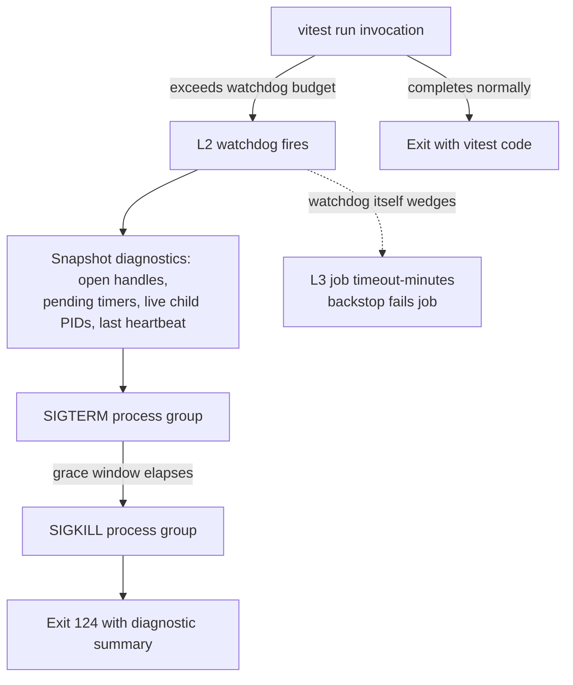

# fix: Eliminate test timeout failures across CI shards, full suite, and changed-file runs

## Summary

Tests in this monorepo fail not because the suite is uniformly slow, but because a small number of **hang / kill / timeout failure modes** are unbounded and undiagnosable. The two structural causes:

1. **Hangs run to the platform ceiling, silently.** Neither `scripts/ci-test-shard.mjs` nor `scripts/test-changed.mjs` imposes a per-invocation wall-clock limit, and `.github/workflows/full-suite.yml` sets **no `timeout-minutes`** on the `test-shards`, `test-slow`, or `test-inventory-guard` jobs. A single wedged vitest invocation blocks until GitHub's 6h default — so a hang looks like a stuck CI job, not a failing test. Only the dashboard lane runner (`packages/dashboard/scripts/run-vitest-with-heap.mjs`) has a wall-clock killer today.
2. **Concurrency-sensitive tests genuinely hang or error under load — across packages.** The quarantine ledger (`scripts/lib/test-quarantine.json`) holds 12 entries spanning **engine** (`merger-ai*`, `reliability-interactions/*`), **core** (`soft-delete-tasks`, `store-get-task-columns`, `task-dependency-mutation`, `task-node-override`, `db`, …, dated 2026-06-12 — newer than the engine entries), and **dashboard** (`QuickEntryBox`). The dominant signature is identical and cross-package: a `fusion-test-workers` temp-root that disappears under concurrent load (`mkdtemp … ENOENT`, leaked redirect dir, `cwd` gone, missing event). That signature traces to the **shared `WORKER_ROOT` redirect in `packages/core/src/__test-utils__/vitest-setup.ts`** (the same module U4 touches), so the root cause is a shared mechanism, not an engine-local quirk. These are real (test-fixture or product) races, not noise.

This plan makes hangs **fail fast and diagnosably** (bounded watchdog + open-handle forensics at every layer), then **root-causes the actual hang cluster** (the shared `WORKER_ROOT` temp-isolation mechanism + the engine/core tests that lean on it, the subprocess-guard mis-fire, serialized-project wedge containment), and adds a **shard-balance guardrail** so tail-shard skew can't silently re-create timeouts. Wall-clock speedup is pursued only where it also reduces timeout risk; pure throughput work (e.g. the deferred Vitest-4 `fsModuleCache`) stays deferred.

**Governing constraint (non-negotiable):** per `AGENTS.md` and `docs/testing.md`, widening timeouts, adding retries, or loosening assertions to make a flake pass is **appeasement and is banned**. Every fix here is either a root-cause fix or an on-sight quarantine via the deletion-ratchet ledger. The bounded-watchdog work in U1 is *not* a timeout widening — it makes an already-unbounded hang terminate sooner with diagnostics.

---

## Problem Frame

**Who hurts and where:**

- **CI (post-merge `full-suite.yml`):** a hung shard is a 6h stuck job with no actionable output; tail-shard duration skew pushes the slowest shard toward timeout.
- **Local full suite (`pnpm test:full` / `test:serial`):** running engine + dashboard heavy packages concurrently is the historical OOM/hang path; a wedged invocation hangs the whole run.
- **Local changed-file runs (`pnpm test` → `test-changed.mjs`):** a hang in an affected package stalls the inner dev loop with no timeout and no forensics.

**The failure modes, concretely:**

| Failure mode | Where it bites | Current behavior |
|---|---|---|
| Wedged vitest invocation (deadlock, leaked handle, real-timer stall) | all three contexts | Runs to GitHub 6h ceiling (CI) or hangs indefinitely (local). No per-invocation watchdog outside dashboard. |
| Concurrency-sensitive test — shared `WORKER_ROOT` temp-root disappears (`cwd` gone, `mkdtemp … ENOENT`, missing event) | engine **and** core suites under full concurrency (also a dashboard entry) | Intermittent failure; quarantined on sight, root cause unfixed. 11 of 12 ledger entries are this class. |
| Subprocess-guard 30s `SIGKILL` mis-fire under load | engine + any spawned-child test | Premature kill attributed to the wrong test (engine already bumped to 120s as a band-aid). |
| Single-worker serialized project wedge | `engine-reliability`, `engine-slow` | One wedged file stalls the entire `fileParallelism:false`, `maxWorkers:1` project; past `SIGTERM 143` kills (FN-5537). |
| Tail-shard duration skew | CI shards | Duration-weighted sharding landed, but timings (`scripts/test-timings.json`, captured 2026-06-03) can drift with no guardrail. |

**Success criteria:**

- No CI test job can run longer than an explicit, committed budget — a hang fails the job in minutes with a diagnostic dump, never at the 6h ceiling.
- A hung local invocation (CI shard or changed-file) terminates within a bounded window and prints what was still pending.
- The cross-package concurrency-sensitivity cluster is root-caused at the shared `WORKER_ROOT` mechanism: the currently-quarantined engine **and** core entries sharing the temp-root-disappeared signature are either rescued with a real fix or deleted per the ratchet — not re-stabilized.
- The subprocess-guard no longer mis-fires under normal concurrent load, or when it does fire it names the offending test/child and reason.
- Shard duration skew is observable and guarded, so tail-shard timeouts can't silently regress.

---

## Scope Boundaries

### In scope
- Per-job `timeout-minutes` on all `full-suite.yml` test jobs and a per-invocation wall-clock watchdog generalized from the dashboard heap runner into `ci-test-shard.mjs` and `test-changed.mjs`.
- Hang forensics: open-handle / pending-operation diagnostics emitted on any timeout or watchdog kill.
- Root-cause fixes for the cross-package concurrency cluster at the shared `WORKER_ROOT` temp-isolation mechanism (engine + core tests; fixture/temp-dir/cwd isolation, deterministic awaits) and rescue-or-delete of the related quarantine entries.
- Hardening the `vitest-setup.ts` subprocess timeout/attribution logic so it stops mis-firing and logs actionable context.
- Containing wedges in serialized single-worker projects (`engine-reliability`, `engine-slow`).
- A shard-balance guardrail (timings freshness + per-shard budget assertion).

### Out of scope (true non-goals)
- Migrating off Vitest or swapping the test runner.
- Re-trialing `isolate: false` or `happy-dom` — both were canaried and rejected (`docs/test-speed-baseline-2026-06-03.md`); the `vitest-setup.ts` module-level `fs`/`child_process`/cwd/HOME mutation makes isolation load-bearing.
- Bulk-deleting or `.skip`-ing tests purely to reduce counts (the quarantine ratchet is the only sanctioned removal path).
- Rewriting application code beyond what a confirmed product-race fix requires.

### Deferred to Follow-Up Work
- Enabling Vitest-4 `experimental.fsModuleCache` with its kill-switch + stale-transform invalidation test (the prior plan's U8, still deferred). Pursue only if a dedicated cold-start/transform-cost measurement (not U2's hang forensics, which surface pending handles rather than transform timing) shows cold-transform cost is a timeout contributor.
- Automating `scripts/test-timings.json` refresh on a schedule (U6 adds the guardrail and the manual refresh path; full automation is a later step).
- Reducing isolation-guard (`check-test-isolation.mjs`) wall-clock overhead — it adds latency, not hangs, so it's outside this reliability scope.

---

## High-Level Technical Design

This plan adds **defense-in-depth timeout layers** so a hang is caught at the tightest applicable boundary and always produces forensics. The layers, innermost to outermost:

| Layer | Boundary | Owner | On expiry |
|---|---|---|---|
| L0 assertion timeout | single `it()` | vitest `testTimeout`/`hookTimeout` (per-package config) | fail that test |
| L1 spawned-child timeout | a child process a test spawns | `vitest-setup.ts` subprocess guard (U4) | `SIGKILL` child, attribute to owning test + log reason |
| L2 invocation watchdog | one `vitest run` invocation | `ci-test-shard.mjs` / `test-changed.mjs` (U1) | `SIGTERM`→`SIGKILL` process group, emit open-handle dump (U2), exit non-zero |
| L3 CI job budget | a GitHub job | `full-suite.yml` `timeout-minutes` (U1) | fail the job (backstop if L2 itself wedges) |

The intent is that **L3 is never the thing that fires** — L2 should always catch a hang first and explain it. L3 exists only as the backstop for a watchdog that itself deadlocks.

When an invocation hangs, the flow is:



*Directional guidance for reviewers — not an implementation spec. The per-invocation watchdog generalizes the existing, proven pattern in `packages/dashboard/scripts/run-vitest-with-heap.mjs` (detached process group, `SIGTERM`→`SIGKILL` after a grace window, exit 124); the new work is hoisting it into the shared runners and adding the diagnostic snapshot.*

---

## Key Technical Decisions

**KTD-1 — Generalize the dashboard watchdog, but treat the runner integration as a sync→async rewrite, not a wrap.** `run-vitest-with-heap.mjs` already spawns vitest detached in its own process group with a `FUSION_RUN_VITEST_TIMEOUT_MS` (default 15min) `SIGTERM`→`SIGKILL` killer, driven by an event-loop `setTimeout`. The reuse target is real, but **both `ci-test-shard.mjs` and `test-changed.mjs` invoke vitest via blocking `spawnSync`** — and a `setTimeout`-based watchdog cannot fire while the calling thread is frozen inside `spawnSync`. So the actual work in those two runners is **converting their invocation path from `spawnSync` to async `spawn` (detached, process-group)** and threading the now-Promise-returning call through their control flow (the sequential shard-command loop, exit-status propagation, `ensureTestArtifacts`/skill-sync ordering, and `test-changed.mjs`'s `runMaybeIsolated` + isolated-HOME teardown). This refactor — not the watchdog itself — is the bulk of U1. The dashboard runner is already async, so its delegation is a true extract-and-reuse with behavior preserved. Rationale: one shared killer, but the plan must size the runner conversions honestly.

**KTD-2 — Per-invocation budgets default to a generous per-class flat ceiling, refined by timings when fresh.** A single global flat timeout would be too tight for `engine-slow` real-git suites or too loose to catch a fast-package hang quickly — but deriving budgets purely from `scripts/test-timings.json` is fragile: the snapshot is 100ms-bucketed and was captured 2026-06-03, and U6 (the freshness guardrail) lands *after* U1, so U1 would derive kill budgets from a possibly-stale file with no guard. Decision: budget = `max(perClassFloor, min(perClassCeiling, expectedDurationMs × multiplier))`, where the **per-class floor/ceiling (one each for shard / changed-file / dashboard-lane) are the load-bearing safety net** and the timings-derived term only *tightens* within that band when the snapshot is fresh. Because a CI shard's `plain` command fans out across multiple packages in one invocation (`pnpm --filter A --filter B … test`), `expectedDurationMs` is the **sum across the packages/lanes packed into that command**, not a per-package lookup — aggregate over the planner's command composition. Refresh `test-timings.json` (`scripts/ci-test-shard.mjs --write-timings`) before U1 derives budgets. Rationale: catches a hang at a multiple of expected duration without making a stale snapshot a false-kill source. This is **not** an assertion-timeout widening; it bounds a currently-unbounded outer wait.

**KTD-3 — Diagnostics use Vitest/Node's own hang reporting, not a bespoke prober, and live inline in the watchdog.** On watchdog fire, request the hanging-process / open-handle information Vitest and Node already expose (e.g. Vitest's hanging-process reporter, `process._getActiveHandles`-class diagnostics, live child PIDs tracked by the subprocess guard). Implement the snapshot as a **local function inside `run-vitest-watchdog.mjs`**, not a separate `scripts/lib/` module — it has exactly one caller (the watchdog's pre-`SIGTERM` hook) at this point, so a standalone library file and its own test boundary would be premature abstraction. Extract later only if a second caller (e.g. the U4 guard-fire path) actually materializes. Rationale: avoids a fragile custom inspector and an unearned file boundary; surfaces the leaked handle/timer that caused the hang.

**KTD-4 — The cross-package cluster gets one root-cause fix at the shared `WORKER_ROOT` mechanism, then rescue-or-delete per test.** The cluster's signature (`fusion-test-workers` temp-root disappears → `mkdtemp … ENOENT` / `cwd` gone / missing event under load) is shared across engine and core entries and traces to the `WORKER_ROOT` redirect in `vitest-setup.ts` plus `vi.waitFor` real-timer polling racing microtask chains under CPU contention (the documented U7 recipe in `docs/test-speed-baseline-2026-06-03.md`). Fix the **shared mechanism first** (per-worker/per-test temp-root lifetime so one file's teardown can't delete another's redirect dir), then per affected test give it an isolated temp root and assert via call-signaled deferreds rather than timer polls. Then, per the ratchet, either rescue each quarantined entry (evidence it catches real regressions + the root-cause fix) or let it be deleted. Rationale: a single shared fix likely clears most of the 11 same-signature entries at once; the anti-appeasement rule forbids re-stabilizing, and a recurring cross-package signature is a mechanism bug, not per-test noise.

**KTD-5 — The subprocess guard ships attribution-first; budget scaling is a data-gated follow-up, not part of this plan.** Engine already overrides the 30s child-`SIGKILL` to 120s because "even 60s can fire prematurely." The in-scope change is **structured logging on fire only** — name the owning test, the child's argv, and elapsed time — which is unambiguously in service of the goal and carries no anti-appeasement risk. The tempting second move, scaling the budget by active worker count / configured concurrency, is **explicitly deferred**: no quarantine entry attributes a failure to the subprocess guard firing, so the "mis-fires under contention" premise is unproven, and silently widening an existing L1 child timeout to make contended runs pass is exactly the shape `AGENTS.md` bans. Only after U3 reduces concurrency pressure and the attribution logging produces evidence that the guard fires on *legitimate* children (not real hangs) should scaling be revisited, with that data in hand. Rationale: a mis-fire that names its victim is debuggable; widening the trigger without evidence is appeasement and could mask a real runaway child.

**KTD-6 — CI job budgets are explicit and committed, sized from observed durations + headroom.** Add `timeout-minutes` to `test-shards`, `test-slow`, and `test-inventory-guard` in `full-suite.yml`, each sized from current observed wall-clock plus headroom (and strictly above the L2 watchdog ceiling so L2 fires first). Rationale: the gate job already does this (`timeout-minutes: 15` in `pr-checks.yml`); the non-blocking tier should not be exempt.

---

## Output Structure

New/changed shared infrastructure (illustrative — per-unit `Files` lists are authoritative):

```text
scripts/
  lib/
    run-vitest-watchdog.mjs        # NEW (U1) — shared bounded-invocation runner + process-group killer;
                                   #            inline hang-diagnostics snapshot lives here (U2), not a separate module
    test-timings.json              # EXISTING — refreshed before U1; tightens watchdog budgets within per-class bands (U1) + feeds shard guardrail (U6)
  ci-test-shard.mjs                # MODIFIED (U1, U6) — spawnSync→async spawn through watchdog; extend existing balance/staleness checks
  test-changed.mjs                 # MODIFIED (U1) — spawnSync→async spawn through watchdog; reconcile with isolated-HOME teardown
  __tests__/
    run-vitest-watchdog.test.mjs   # NEW (U1) — watchdog contract + inline diagnostics snapshot
    ci-shard-budget.test.mjs       # NEW (U6) — balance + freshness assertions
.github/workflows/
  full-suite.yml                   # MODIFIED (U1) — timeout-minutes on all test jobs
packages/
  dashboard/scripts/run-vitest-with-heap.mjs   # MODIFIED (U1) — delegate to shared watchdog (already async; behavior preserved)
  core/src/__test-utils__/vitest-setup.ts      # MODIFIED (U3 WORKER_ROOT temp-root lifetime; U4 guard attribution logging; U2 hanging-process reporting)
  core/src/__tests__/...                        # MODIFIED (U3) — core temp-redirect quarantine cluster: per-test temp isolation
  engine/src/__tests__/...                      # MODIFIED (U3) — engine cluster: fixture isolation, deterministic awaits
  engine/vitest.config.ts                       # MODIFIED (U3, U5) — quarantine exclude edits; serialized-project tuning
scripts/lib/test-quarantine.json                # MODIFIED (U3) — rescue/delete cluster entries (engine + core)
```

---

## Implementation Units

### U1. Bound every test invocation and CI job with a fail-fast watchdog

**Goal:** No vitest invocation or CI job can hang past an explicit budget; a hang terminates the process group and exits non-zero in minutes, not hours.

**Requirements:** Success criteria 1 & 2 (no 6h black holes; local hangs bounded). Addresses failure modes "wedged invocation" and "tail-shard skew" (backstop). KTD-1, KTD-2, KTD-6.

**Dependencies:** none (foundational).

**Files:**
- `scripts/lib/run-vitest-watchdog.mjs` (new) — shared **async** detached-spawn + `SIGTERM`→`SIGKILL`-after-grace runner, per-class budget bands tightened by `scripts/test-timings.json`, exit-124 contract, inline hang-diagnostics snapshot (U2).
- `scripts/ci-test-shard.mjs` (modify) — **convert the `spawnSync` invocation path to async `spawn` through the watchdog** and thread the Promise through the sequential shard-command loop, exit-status propagation, and `ensureTestArtifacts`/skill-sync ordering.
- `scripts/test-changed.mjs` (modify) — same `spawnSync`→async conversion; reconcile the watchdog's process-group kill + signal forwarding with the **existing `SIGINT`/`SIGTERM`/`exit` isolated-HOME cleanup handlers** and `runMaybeIsolated`'s before/after passes so a watchdog kill does not leak HOME dirs (the exact thing the isolation guard then flags).
- `packages/dashboard/scripts/run-vitest-with-heap.mjs` (modify) — delegate to the shared helper (already async; true extract-and-reuse); preserve the 6144MiB heap flag, 15min default, 5s grace, heartbeat, signal forwarding, and its signal-re-raise-on-signalled-exit behavior.
- `.github/workflows/full-suite.yml` (modify) — add `timeout-minutes` to `test-shards`, `test-slow`, `test-inventory-guard`.
- `scripts/__tests__/run-vitest-watchdog.test.mjs` (new).

**Approach:** Extract the dashboard killer's process-group lifecycle into the shared async helper, parameterized by command, env, heap flag, and budget. Budget = `max(perClassFloor, min(perClassCeiling, expectedDurationMs × multiplier))` per KTD-2 — the per-class floor/ceiling (shard / changed-file / dashboard-lane) are the safety net; the timings term (aggregated across all packages in a multi-package `plain` command, multiplier 3-4×) only tightens within the band, and only when the snapshot is fresh; when timings are absent or stale, `deriveBudgetMs` falls back to the per-class **ceiling** (never a median). **Refresh `test-timings.json` before deriving budgets.** CI `timeout-minutes` must exceed the worst-case L2 ceiling so L2 always fires first; document the ordering in a comment. Forwards external signals; cleans up on exit/SIGINT/SIGTERM like the existing runners. Note the two runners import each other and are imported by tests — verify the async conversion doesn't break any synchronous-import caller.

**Execution note:** Start with a failing test for the watchdog contract (spawns a deliberately-hanging child, asserts `SIGTERM`-then-`SIGKILL` and exit 124 within budget) before extracting the helper.

**Patterns to follow:** `packages/dashboard/scripts/run-vitest-with-heap.mjs` (process-group kill, detached spawn, grace window, heartbeat); existing `scripts/__tests__/*.test.mjs` style (`node --test`). Respect the port-4040 kill guards — the watchdog kills its own process group only, never by port (`scripts/check-no-kill-4040.mjs`, `AGENTS.md`).

**Test scenarios:**
- Happy path: a child that exits 0 within budget → watchdog returns the child's exit code, no kill signal sent.
- Happy path: a child that exits non-zero → exit code propagated unchanged.
- Timeout: a child that never exits → `SIGTERM` at budget, `SIGKILL` after the grace window, exit 124, within `budget + grace + epsilon`.
- Edge: budget derivation when the package is absent from `test-timings.json` → per-class floor used; when present → `expected × multiplier`, clamped to the per-class floor/ceiling band.
- Edge: multi-package `plain` command (e.g. `--filter A --filter B test`) → budget aggregates the expected durations of all packed packages, not a single-package lookup.
- Edge: external `SIGTERM`/`SIGINT` to the wrapper → forwarded to the child group, HOME/temp cleanup still runs.
- Integration: a watchdog `SIGKILL` of a hung `test-changed.mjs` invocation → isolated-HOME teardown still runs (no leaked `fusion-test-homes`), and the existing isolation guard passes on the next run.
- Integration: `ci-test-shard.mjs` run with a stubbed hanging command → shard exits non-zero with the watchdog's diagnostic, does not block.
- Regression: dashboard lane via `run-vitest-with-heap.mjs` still applies the 6144MiB heap flag and 15min default after delegation (assert the spawned argv/env).
- Config assertion: parse `.github/workflows/full-suite.yml` and assert every test job declares `timeout-minutes` strictly greater than the configured L2 ceiling.

**Verification:** A deliberately-wedged test invocation fails locally and in a CI dry-run within minutes with exit 124; the dashboard suite behaves identically to before; `full-suite.yml` jobs all carry a budget.

---

### U2. Emit hang forensics on every timeout

**Goal:** When the watchdog (U1) or a vitest test times out, the run prints what was still pending — open handles, pending timers, live child PIDs, last heartbeat — so the next hang is diagnosable instead of silent.

**Requirements:** Success criterion 2 (bounded *and* diagnosable). Enables root-causing U3/U4/U5. KTD-3.

**Dependencies:** U1 (the watchdog is the trigger point and the home for the inline snapshot).

**Files:**
- `scripts/lib/run-vitest-watchdog.mjs` (modify, from U1) — add an **inline** snapshot function (active handles/requests, live tracked child PIDs + argv, elapsed-since-heartbeat) producing a compact, log-safe summary, called immediately before `SIGTERM`. Not a separate module (KTD-3) until a second caller exists.
- `packages/core/src/__test-utils__/vitest-setup.ts` (modify) — ensure Vitest's hanging-process reporting is enabled/surfaced so an in-test hang (L0/L1) also produces handle info.

**Approach:** Prefer Node/Vitest built-ins (hanging-process reporter, active-handle enumeration) over a custom inspector (KTD-3). Redact paths/secrets per existing logging conventions. Keep output bounded (cap the number of handles listed) so a hang dump can't itself flood/wedge CI logs. The snapshot's unit tests live in `scripts/__tests__/run-vitest-watchdog.test.mjs` alongside the watchdog that calls it.

**Patterns to follow:** the subprocess guard's existing child-PID tracking in `vitest-setup.ts` (reuse its registry for "live children" rather than re-enumerating); existing log redaction helpers.

**Test scenarios:**
- Happy path: snapshot with a known leaked timer present → summary names the timer/handle type.
- Happy path: snapshot with a tracked live child → summary lists its PID and argv.
- Edge: no open handles → summary states "no pending handles" rather than empty/garbage.
- Edge: output exceeds the cap → list is truncated with a "+N more" marker, not unbounded.
- Integration: watchdog fire path (with U1) prints the snapshot before `SIGTERM` (assert ordering in the wrapper's output).
- `Covers` the diagnosability success criterion: a wedged invocation's output contains an actionable handle/child reference.

**Verification:** Trigger a known hang (a test that leaves a timer/socket open); confirm the failure output names it.

---

### U3. Root-cause the cross-package `WORKER_ROOT` concurrency cluster

**Goal:** The shared `WORKER_ROOT` temp-isolation mechanism stops letting one file's teardown disturb another's redirect dir under concurrent load, and the engine **and** core tests quarantined with that signature are fixed at root cause (or deleted per the ratchet) — no re-stabilization.

**Requirements:** Success criterion 3. Addresses the cross-package "shared `WORKER_ROOT` temp-root disappears" failure mode. KTD-4. Honors the `AGENTS.md` anti-appeasement standing rule and the quarantine deletion ratchet.

**Dependencies:** U2 (forensics make the leaked state visible); benefits from U1 (bounded reproduction). Not hard-blocked by U1/U2 — the shared-mechanism analysis can begin immediately (this is the highest-pain work; see Sequencing).

**Files:**
- `packages/core/src/__test-utils__/vitest-setup.ts` (modify) — **the shared fix:** make the `WORKER_ROOT` redirect's temp-root lifetime per-worker/per-test so one file's cleanup can't `rm` another's active dir; this is the common cause behind the 11 same-signature entries.
- `packages/core/src/__tests__/` cluster (modify) — `soft-delete-tasks.test.ts`, `store-get-task-columns.test.ts`, `task-dependency-mutation.test.ts`, `task-node-override.test.ts`, `db.test.ts`, `store-create-summarize-deferred-hook.test.ts`: per-test temp-root isolation; deterministic call-signaled awaits where a timer poll races.
- `packages/engine/src/__tests__/merger-ai.test.ts`, `merger-ai-cleanup.test.ts`, `merger-ai-cleanup-active-session.test.ts`, `bubblewrap-backend.test.ts` (modify) — same treatment; verify `activeSessionRegistry` / `realpathSync` / cwd assumptions don't leak across files.
- `packages/engine/src/__tests__/reliability-interactions/soft-delete-blocker-residue.test.ts` (modify) — missed-event assertion via deterministic await.
- `packages/engine/vitest.config.ts` and the core vitest config (modify) — remove the `exclude` lines for any test rescued.
- `scripts/lib/test-quarantine.json` (modify) — remove rescued entries (with PR evidence) or delete expired ones per the ratchet.

**Approach:** First confirm the shared mechanism via U2 forensics — reproduce a core entry and an engine entry under concurrent load (`pnpm --filter @fusion/core test`, `pnpm --filter @fusion/engine test`, not standalone) and verify both fail on the same `fusion-test-workers` temp-root disappearance. Fix `vitest-setup.ts`'s `WORKER_ROOT` lifetime once, then re-run the whole quarantined set to see how many clear from the single fix. For residual per-test races, give each test an isolated temp root and await a deferred resolved by the spied function (`signalOnCall`-style) instead of polling a timer. If a flake reveals a **real product race** (KTD-4: a second quarantine in a subsystem is a smell), fix the product code and document via `/ce-compound`. Do not widen timeouts or add retries.

**Execution note:** Characterization-first — reproduce the flake reliably under concurrency before changing anything, so the fix is provably the cause.

**Patterns to follow:** the U7 deterministic-await recipe in `docs/test-speed-baseline-2026-06-03.md`; the product-race escalation example in `docs/solutions/ui-bugs/skill-autocomplete-highlight-reset-on-swr-revalidation.md`; existing engine test temp-dir/`mkdtemp` helpers.

**Test scenarios:**
- Shared-mechanism fix: a stress harness that runs two files redirecting through `WORKER_ROOT` concurrently, where one finishes and tears down while the other is mid-`mkdtemp` → the second no longer hits `ENOENT` on its redirect dir.
- Each rescued test passes **standalone AND** under full concurrent suite load (`pnpm --filter @fusion/core test`, `pnpm --filter @fusion/engine test`), repeated (e.g. 10×) without flake.
- Mutate-to-prove: break the product branch the rescued test covers → the test fails (assertion still bites; not a vacuous pass).
- `merger-ai` temp-checkout-disappeared path: under concurrency, the test no longer hits git `ENOENT` / "unable to read cwd".
- `soft-delete-blocker-residue`: the missed `task:deleted` event log entry is asserted via a deterministic await, not a timer poll.
- Ratchet integrity: every entry removed from `test-quarantine.json` has a matching `exclude` removal in the same commit (assert via the existing inventory/quarantine conventions); expired entries deleted are recorded in the commit.

**Verification:** 10× concurrent core- and engine-suite runs with zero flake in the targeted files; quarantine ledger no longer lists the rescued entries; mutation testing confirms assertions bite.

---

### U4. Make the subprocess guard self-documenting on fire (attribution logging)

**Goal:** When the `vitest-setup.ts` child-process `SIGKILL` guard fires, it names the owning test, the child argv, and elapsed time — converting a silent kill into a debuggable event and producing the evidence needed to decide *later* whether the guard mis-fires under contention.

**Requirements:** Success criterion 4 (the "or when it does fire it names the offending test/child and reason" clause). Addresses the "subprocess-guard mis-fire" failure mode's diagnosability half. KTD-5.

**Dependencies:** U2 (reuse forensics/child-PID registry).

**Files:**
- `packages/core/src/__test-utils__/vitest-setup.ts` (modify) — `registerTrackedSubprocess` / `withDefaultTimeout` / `afterEach` attribution: emit a one-line structured record (`test id`, `argv`, `elapsedMs`, `reason`) whenever the guard kills a child. **No change to the trigger budget in this unit.**
- the corresponding `vitest-setup` test (locate under `packages/core/.../__tests__/`) (modify/add).

**Approach:** Keep the guard's behavior and safety purpose (kill genuinely-runaway children, block real-AI-CLI/port-4040) exactly intact; add only the structured logging on fire. **Deliberately out of scope (deferred to a data-gated follow-up, per KTD-5):** scaling the budget by active worker count / concurrency. No quarantine entry attributes a failure to this guard, so the "mis-fires under contention" premise is unproven, and widening an L1 child timeout without evidence is the appeasement shape `AGENTS.md` bans and could delay detection of a real runaway child. The attribution logging this unit ships is what produces that evidence; revisit scaling only if it shows the guard firing on legitimate children after U3 reduces concurrency pressure.

**Patterns to follow:** the guard's existing kill/attribution code paths; existing structured-log/redaction helpers in `vitest-setup.ts`.

**Test scenarios:**
- Happy path: a child completing within budget → not killed, no log emitted.
- Timeout: a genuinely-runaway child exceeding the budget → killed (same as today), structured record emitted with owning test id, argv, elapsed, reason.
- Edge: child completes during the grace window → no false kill, no spurious log.
- Regression: real-AI-CLI launch block and port-4040 kill block still fire (guard safety preserved); the kill budget is unchanged from current behavior.
- Mutate-to-prove: disable the attribution → test detects the missing owner reference.

**Verification:** Run the suite under high concurrency; confirm guard behavior is unchanged and any kill carries a named owner + argv in the output, giving a clear signal for the deferred scaling decision.

---

### U5. Contain wedges in serialized single-worker projects

**Goal:** A single wedged file in `engine-reliability` or `engine-slow` (both `fileParallelism:false`, `maxWorkers:1`) fails fast rather than stalling the whole project to a `SIGTERM 143`.

**Requirements:** Success criterion 1 (within-project containment). Addresses the "single-worker serialized project wedge" failure mode (FN-5537 history).

**Dependencies:** U1 (invocation watchdog is the outer net); U2 (forensics).

**Files:**
- `packages/engine/vitest.config.ts` (modify) — evaluate a per-file/per-test `testTimeout` appropriate to the serialized projects (root-cause-bounded, not appeasement), and assess whether `engine-reliability` can be split so a wedge doesn't block unrelated files. Document the rationale inline (these projects already carry detailed justification comments).

**Approach:** The serialized projects exist for real reasons (real worktrees, event-ordering, rowid interleaving — see existing comments). Do **not** parallelize them blind. Instead bound them: ensure a single file's hang is caught by the U1 watchdog with U2 forensics, and consider whether the project can be partitioned into independent serial groups so an unrelated wedge doesn't take the whole project down. If splitting risks the documented ordering guarantees, keep serial and rely on the watchdog + diagnostics as the containment.

**Execution note:** Decision-bearing, three possible outcomes — (a) partition the serialized project into independent serial groups; (b) if splitting endangers the FN-5521/FN-5537 ordering guarantees, keep serial and record that the U1 watchdog is the chosen containment; (c) **if the U1 watchdog fully contains the wedge risk AND current `testTimeout` values are already appropriate, this unit produces zero code changes** — capture the rationale in a config comment and close. Do not let the `testTimeout` evaluation manufacture a change that serves no confirmed gap. Capture whichever outcome holds in the config comment.

**Patterns to follow:** the existing per-project comments in `packages/engine/vitest.config.ts` (`engine-reliability`, `engine-slow`); the worker-cap audit test referenced in the prior plan (any pool/worker change must pass it — `docs/plans/2026-06-03-001-perf-test-suite-speedup-plan.md` U5).

**Test scenarios:**
- A deliberately-wedged file in the serialized project → caught by the U1 watchdog with forensics, project exits non-zero promptly (not at job ceiling).
- Regression: the documented ordering-sensitive suites (`shared-branch-group-lifecycle`, `branch-group-automerge-precedence`) still pass after any partition.
- Worker-cap audit: if pool/worker settings change, the FN-5048 cap-audit test still passes (effective concurrency not raised).
- `Test expectation` note: if the analysis concludes "no split, watchdog is containment," this unit's only code change is documented config + the wedge-containment test above.

**Verification:** Wedged-file injection in the serialized project fails fast; ordering-sensitive suites unaffected; cap-audit green.

---

### U6. Guard against tail-shard duration skew

**Goal:** Shard duration imbalance is observable and asserted, so a stale `test-timings.json` can't silently recreate a slow tail shard that drifts toward timeout.

**Requirements:** Success criterion 5. Addresses the "tail-shard duration skew" failure mode.

**Dependencies:** U1 (CI budgets define the ceiling the guardrail measures against).

**Files:**
- `scripts/ci-test-shard.mjs` (modify) — **extend the existing balance/staleness logic, do not re-derive it.** The planner already enforces a `DEFAULT_BALANCE_TOLERANCE = 0.05` variance loop and emits a staleness warning via `TIMINGS_STALENESS_DAYS = 30`, with a `--check-timings-staleness` CLI mode. The new work is a **post-plan assertion that the worst-shard projected duration stays below the U1 L2 ceiling** (a failure mode the existing variance loop doesn't catch — balanced-but-all-slow shards), reusing the existing tolerance/staleness constants rather than introducing divergent ones.
- `scripts/__tests__/ci-shard-budget.test.mjs` (new) — unit-test the new vs-ceiling assertion (and that it reuses the existing constants).
- `docs/testing.md` (modify) — document the manual timings-refresh path (`scripts/ci-test-shard.mjs --write-timings`) and the freshness expectation.

**Approach:** Build on the existing duration-weighted best-fit-decreasing planner and its `DEFAULT_BALANCE_TOLERANCE` / `TIMINGS_STALENESS_DAYS` / `--check-timings-staleness` machinery. Add one new post-plan check the existing logic lacks: max-shard projected duration ≤ the U1 L2 ceiling (catches the case where shards are well-balanced but all too slow). This is observability + a guardrail extension, not a re-architecture of sharding, and must not introduce a second tolerance constant.

**Patterns to follow:** the existing weighting/slicing logic in `scripts/ci-test-shard.mjs`; the per-shard timings upload already in `full-suite.yml`.

**Test scenarios:**
- Balanced timings → guardrail passes, no warning.
- Skewed timings (one package dominating) → guardrail flags the over-budget shard with the offending package named.
- Stale snapshot (age > threshold) → freshness warning emitted with the snapshot date.
- Edge: missing timings entirely → median-fallback path still plans and the guardrail degrades gracefully (warns, doesn't crash).
- Integration: a synthetic timings fixture that would push a shard past the U1 ceiling → guardrail fails the dedicated check.

**Verification:** Inject a skewed timings fixture; confirm the guardrail names the over-budget shard; confirm a fresh snapshot passes clean.

---

## Risks & Mitigations

| Risk | Likelihood | Impact | Mitigation |
|---|---|---|---|
| `spawnSync`→async conversion of `ci-test-shard.mjs` / `test-changed.mjs` (U1) is underestimated and slips, cascading to dependent units | Medium | High | Treat it as a rewrite in scoping (KTD-1), not a wrap; land the watchdog helper + dashboard delegation first (already async), then convert each runner behind its own test; verify no synchronous-import caller breaks. |
| Watchdog budget (U1) too tight (esp. from stale `test-timings.json`) → kills legitimately-slow real-git suites | Medium | High (false failures) | Per-class floor/ceiling bands are the safety net; timings only *tighten* within the band and only when fresh; refresh the snapshot before deriving budgets; validate against `engine-slow` observed durations before merge (KTD-2). |
| The `WORKER_ROOT` shared-mechanism fix (U3) is larger than the cluster suggests, or some entries have distinct causes | Medium | Medium | Confirm the shared signature on one core + one engine entry before the fix; after the single fix, re-run the full quarantined set and treat residuals as separate per-test work rather than assuming one fix clears all. |
| "Fixing" the cluster (U3) drifts into appeasement | Medium | High (banned by policy) | Characterization-first repro + mutate-to-prove; rescue requires documented real-regression evidence; default to ratchet deletion over re-stabilization. |
| Splitting serialized projects (U5) breaks ordering guarantees | Medium | High | Decision-gated (KTD/execution note); default to "no split, watchdog is containment" if ordering is at risk; cap-audit test must stay green. |
| CI `timeout-minutes` set below true worst case → flaky job failures | Low | Medium | Size from observed wall-clock + headroom, strictly above L2 ceiling; start generous and tighten with data. |
| Hang-diagnostics output (U2) floods CI logs | Low | Low | Cap handle list with "+N more"; redact paths. |

## Dependencies / Sequencing

- **U1 → U2** (watchdog is the diagnostics trigger; U2's snapshot lives inside the U1 helper).
- **U2 aids U3, U5** (forensics make the leaked state visible) but is **not a hard blocker** — U3's shared-mechanism analysis can begin in parallel.
- **U1 → U6** (the L2 ceiling defines what U6 asserts against).

**Two tracks, run in parallel:**
- **Reliability track — start here, highest pain.** U3 fixes the actual red tests: 11 of 12 quarantine entries share the `WORKER_ROOT` signature, and the watchdog (U1) fixes none of them — it only makes their eventual failure faster and louder. The single shared-mechanism fix is the highest-leverage change in the plan.
- **Guardrail track.** U1 + U2 (fail-fast watchdog + forensics) close the real CI black-hole gap (no `timeout-minutes` on `full-suite.yml`) and produce the diagnostics U3 leans on. U4 (attribution logging) and U6 (shard-vs-ceiling guardrail) follow U1.

Honest framing: the guardrail track does not turn the suite green on its own — it bounds and explains hangs and prevents regressions. U3 is what removes the standing red. Sequence so U3 is not starved behind the guardrail work. U5 last (containment, depends on U1).

## Sources & Research

- `docs/plans/2026-06-03-001-perf-test-suite-speedup-plan.md` — sibling speedup plan; duration-based sharding (U6), worker-cap policy (U5), deferred `fsModuleCache` (U8).
- `docs/test-speed-baseline-2026-06-03.md` — `isolate:false` and happy-dom canaries rejected; U7 deterministic-await flake recipe.
- `docs/test-speed-audit-FN-5048.md` — FN-6308 dashboard heap-wrapper + bounded-concurrency pattern.
- `docs/testing.md` — quarantine ledger / deletion ratchet; anti-appeasement rule; engine-slow tier.
- `AGENTS.md` — standing rules: do-not-add-slow-tests (FN-5048), flaky-tests-quarantined-on-sight, never widen timeouts/retries to pass flakes, port-4040 protection.
- `scripts/lib/test-quarantine.json` — current cross-package concurrency cluster: 12 entries across engine (`merger-ai*`, `reliability-interactions/*`, `bubblewrap-backend`), core (`soft-delete-tasks`, `store-get-task-columns`, `task-dependency-mutation`, `task-node-override`, `db`, `store-create-summarize-deferred-hook`, dated 2026-06-12), and dashboard (`QuickEntryBox`); 11 share the `fusion-test-workers` temp-root-disappeared signature.
- Repo research: harness map across `scripts/test-changed.mjs`, `scripts/ci-test-shard.mjs`, `packages/dashboard/scripts/run-vitest-with-heap.mjs`, `packages/core/src/__test-utils__/vitest-setup.ts`, `.github/workflows/full-suite.yml`.
- **Note on the "vitest auto-kill incident":** confirmed **fixed** (CLI freemem-metric SIGKILL bug, `packages/core/src/vitest-processes.ts` filtering + `process.availableMemory()` guard). Any remaining exit-137/SIGKILL is real memory pressure or a different killer — do not attribute it to that incident.

## Deferred Implementation Notes

- Exact per-class watchdog floor/ceiling bands and the timings multiplier — tune against a freshly-refreshed `test-timings.json` during U1.
- Whether the single `WORKER_ROOT` lifetime fix clears all 11 same-signature entries or leaves per-test residuals — determined empirically after the shared fix in U3.
- Whether `engine-reliability` can be partitioned without breaking ordering — resolved during U5 analysis.
- Whether any U3 flake is a test-fixture race vs. a real product race — determined per-test during characterization; product fixes documented via `/ce-compound`.
- Exact `timeout-minutes` values per CI job — sized from current run durations during U1.
